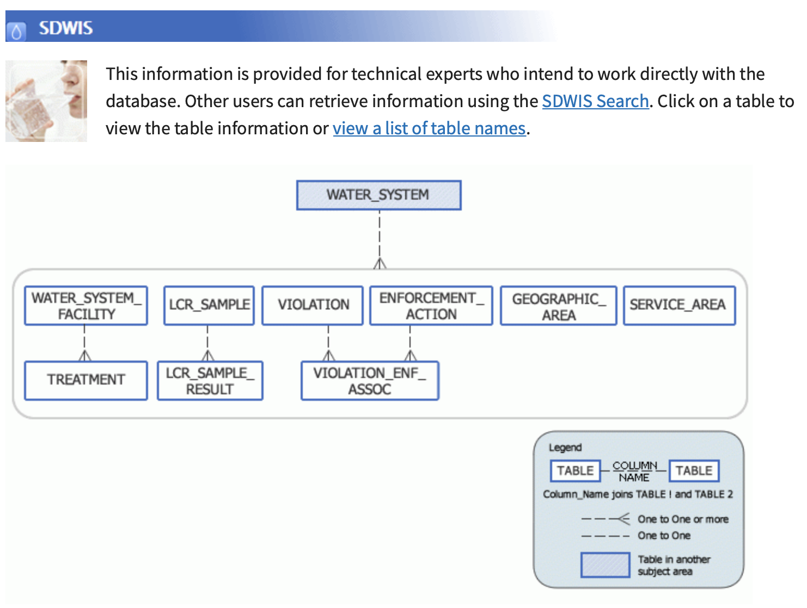
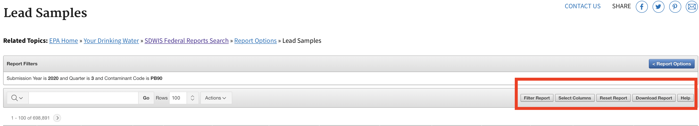

# Lead in Tap Water Tests and socioeconomic data in the United States

The Rockefeller Foundation is releasing a series of datasets of lead in tap water test results. The raw data was obtained from the [Safe Drinking Water Information System](https://ofmpub.epa.gov/apex/sfdw/f?p=108:35:::::P35_REPORT2:LCR) (SDWIS) Federal Reporting System and we have coupled it with socioeconomic variables from the American Community Survey. The datasets have been cleaned and code to reproduce will be included in this repository.

This data powers our [dashboard](https://public.tableau.com/profile/rf.data#!/vizhome/IllustrativeLeadDashExtracted/DataWithThumbnail) tracking the lead tests results at the county and Public Water System levels which is also available for the public.

  

## Datasets

### Raw data

The `data` folder contains the raw downloads from EPA SDWIS including lead samples at the 90th percentile, public water system geographic coverage and the violations to the Lead and Copper Rule (prior to the 2020 revisions).

The files `lead_samples-X.csv` contain the lead test samples at the 90th percentile level reported by water systems. Because SDWIS only allows 150K rows at the time, we had to query the system several times to obtain data going back the early 1990s.

The files `water_system_geographic_area-X.csv` contain the geographic coverage that the water system serves (or served, as many of these water systems have been deactivated).

Finally, the `violation_report.csv` contains all the water violations to the Lead and Copper Rule (prior to the 2020 revisions) per water systems from the 1990s until the third quarter of 2020.

### Clean data

The compressed folder `data_clean.zip` contains two main files:

- `lead_samples_historical.csv` which includes a clean dataset containing lead test samples dating to the early 1990s. Many of those water systems might not be active anymore and you can review the `data_dictionary.csv` file to filter for active water systems.

- `leadtest_acs_14_18.geojson` is a JSON file containing the lead samples between 2014 and 2018 along with variables from the 2018 American Community Survey covering the same period (2014-2018). If you want to know lead trends across the country by county, this is the file you want!

The ACS data comes from the [2014 - 2018 ACS 5-year estimates](https://www.census.gov/programs-surveys/acs/technical-documentation/table-and-geography-changes/2018/5-year.html) and we used the incredibly useful [`tidycensus` R package ](https://walker-data.com/tidycensus/) by Kyle Walker and Matt Herman.

### Data Dictionary

- `data_dictionary.csv` includes definition of all variables in the `lead_acs_data_2012_2019.csv` and `water_system_summary_active.csv` files.

## Script

There are two main scripts:

- `utils.R` has the list of packages you need to install prior to running the main script.

- `clean_epa_script.R` contains the main code used to clean the EPA data and match it to the ACS county level socioeconomic data. You can recreated the clean data by running this script.

## About EPA water information retrieval system

There are two main ways to access EPA's lead water testing, each of them has some benefits over the other depending on level of granularity one needs.

## Environmental Data Service API

The [Envirofacts Data Service API](https://www.epa.gov/enviro/envirofacts-data-service-api) is a single point of access to query EPA's public datasets. One can access lead testing data by querying the appropriate tables (under the [Safe Drinking Water Information System](https://www.epa.gov/enviro/sdwis-model)).

Queries like the one below yield CSV-formatted data from the `LCR_SAMPLE` where the sampling start date is January 1st 2005.

https://data.epa.gov/efservice/LCR_SAMPLE/SAMPLING_START_DATE/01-JAN-05/CSV

*Benefits*: You can automate the process to query the data by pinging the URLs and easily save the data.

*Limitations*: You need familiarity with SDWIS data in order to make accurate queries. Sadly, it seems data available through the API is truncated to early 2000s. Using the SDWIS reporting tool, you can access data going back to 1991. The query is limited to 100K rows.

## SDWIS Federal Reports Advanced Search

The [SDWIS search tool](https://ofmpub.epa.gov/apex/sfdw/f?p=108:35:::::P35_REPORT2:LCR) is a more traditional query tool interface. The lead testing data is under `Report Options` by selecting `Lead and Copper Report`.

In order to download all available samples, you need to select `Lead Samples` under the `Water System` section and remove all the dates in the sampling start and end dates and leave all the options as they are. As of 2020 (third quarter) there were 698,891 rows of data dating back to the 1990s.

You can also select the columns you need to display and download on the top right options.

<INSERT IMAGE>

*Benefits*: Easy to search and filter data. Unlike the API you can download 150K rows of data at a time and it includes historical data from 1990s.

*Limitations*: The tool is often slow to load data and it not often intuitive what the columns mean. Th process cannot be as easily automated for data retrieval compared to the API.

## Attribution and License

The datasets in this repository are publicly available for non-commercial purposes including use by academics, nonprofits and the general public.

Using this data requires attribution to "The Rockefeller Foundation" in any publication or report. We are currently using Creative Commons Attribution-NonCommercial 4.0 International license. You can read the terms in the [LICENSE](https://github.com/datasciencerf/lead_water_acs_data/blob/main/LICENSE).

## Contact Us

If you have questions about the data or licensing conditions, please contact us Lead-Data@rockfound.org

## Contributors

Sue Marquez, Data Science Manager\
Michelle Leonard, Data Visualization consultant
