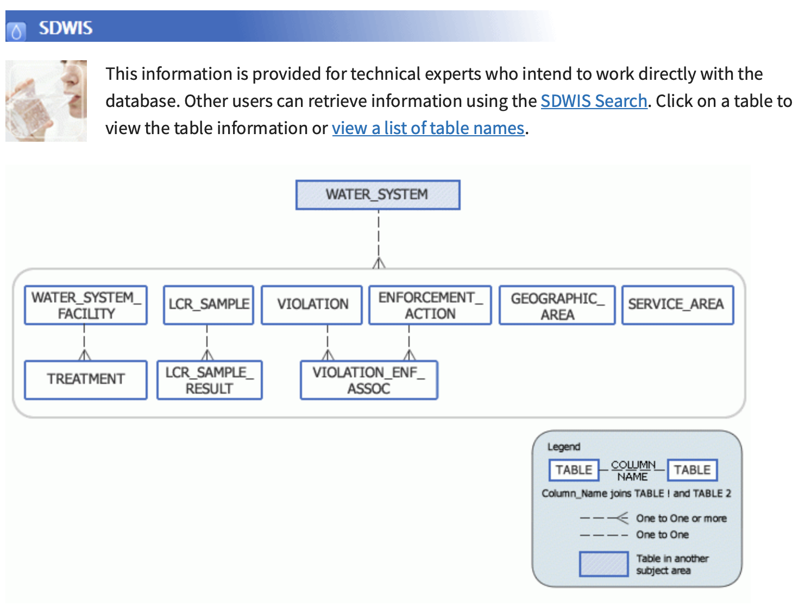
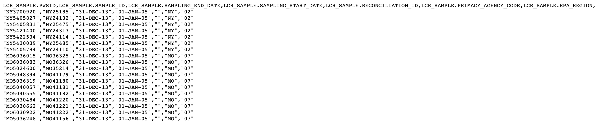
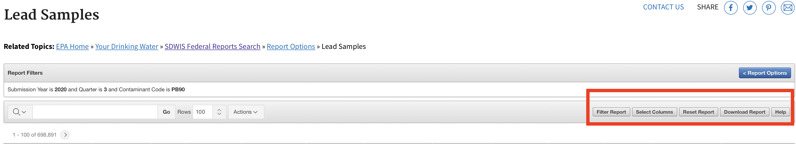

# About EPA water information retrieval system

There are two main ways to access EPA's lead water testing, each of them has some benefits over the other depending on level of granularity one needs.

## Environmental Data Service API

The [Envirofacts Data Service API](https://www.epa.gov/enviro/envirofacts-data-service-api) is a single point of access to query EPA's public datasets. One can access lead testing data by querying the appropriate tables (under the [Safe Drinking Water Information System](https://www.epa.gov/enviro/sdwis-model)).

Queries like the one below yield CSV-formatted data from the `LCR_SAMPLE` where the sampling start date is January 1st 2005.

https://data.epa.gov/efservice/LCR_SAMPLE/SAMPLING_START_DATE/01-JAN-05/CSV

*Benefits*: You can automate the process to query the data by pinging the URLs and easily save the data.

*Limitations*: You need familiarity with SDWIS data in order to make accurate queries. Sadly, it seems data available through the API is truncated to early 2000s. Using the SDWIS reporting tool, you can access data going back to 1991. The query is limited to 100K rows.

## SDWIS Federal Reports Advanced Search

The [SDWIS search tool](https://ofmpub.epa.gov/apex/sfdw/f?p=108:35:::::P35_REPORT2:LCR) is a more traditional query tool interface. The lead testing data is under `Report Options` by selecting `Lead and Copper Report`.

In order to download all available samples, you need to select `Lead Samples` under the `Water System` section and remove all the dates in the sampling start and end dates and leave all the options as they are. As of 2020 (third quarter) there were 698,891 rows of data dating back to the 1990s.

You can also select the columns you need to display and download on the top right options.

<INSERT IMAGE>

*Benefits*: Easy to search and filter data. Unlike the API you can download 150K rows of data at a time and it includes historical data from 1990s.

*Limitations*: The tool is often slow to load data and it not often intuitive what the columns mean. Th process cannot be as easily automated for data retrieval compared to the API.
